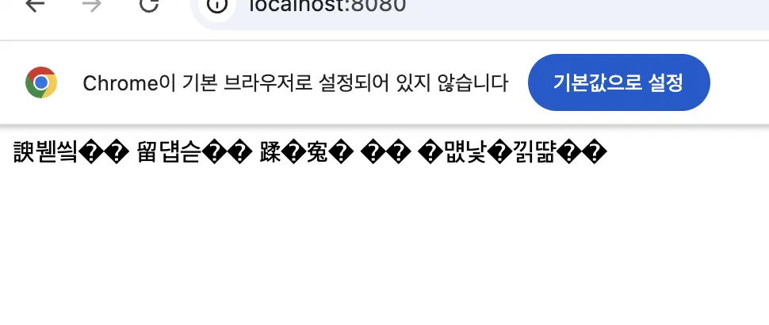
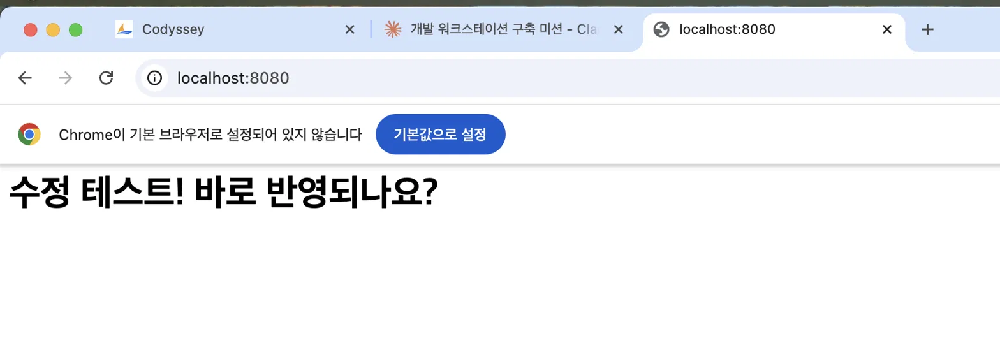
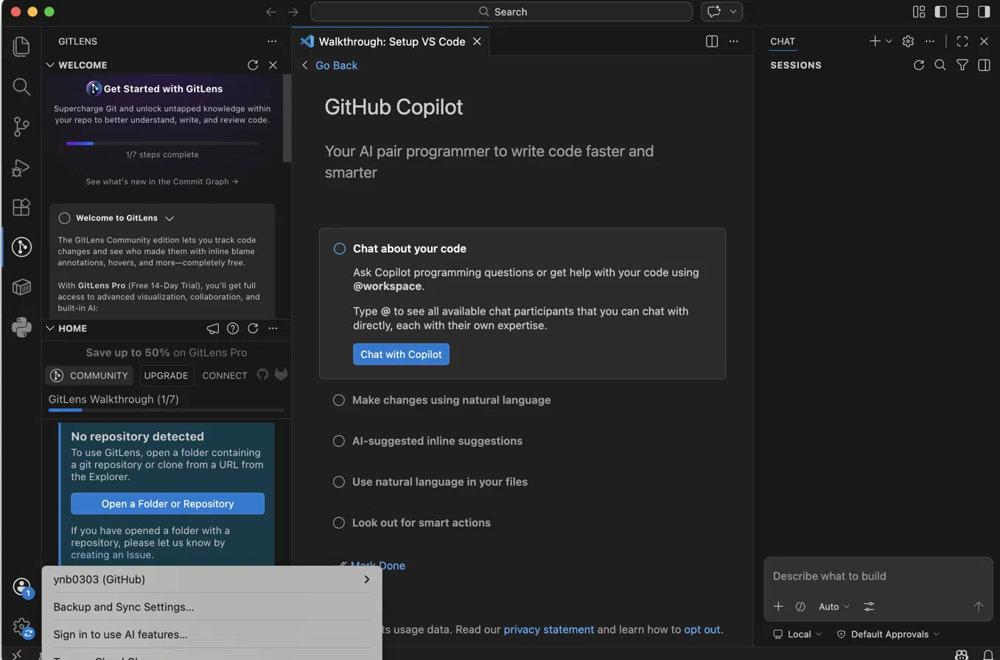

# Codyssey Mission1 — 개발 워크스테이션 세팅 (터미널 / Docker / Git)

## 프로젝트 구조

```bash
docker-mission/
├── Dockerfile        # nginx 기반 이미지 빌드 정의
├── index.html        # 컨테이너에 복사되는 정적 웹 페이지
└── README.md         # 실습 기록 및 결과 문서
```

**재현 방법**: 이 폴더를 클론한 뒤 아래 순서로 실행하면 동일하게 재현할 수 있다.

```bash
docker build -t my-web .
docker run -d -p 8080:80 --name my-web-container my-web
```

---

## 1. 미션 개요

터미널, Docker, Git을 직접 손으로 세팅해보며, 코드가 "내 컴퓨터에서만 되는" 문제를 줄이고 누구나 같은 방식으로 실행할 수 있는 개발 환경을 구성하였다. 터미널로 작업 디렉토리를 정리하고, Docker로 웹 서버를 컨테이너화한 뒤 포트 매핑, 바인드 마운트, 볼륨을 이용해 "변경 반영"과 "데이터 영속성"을 직접 검증했다. 마지막으로 Git/GitHub로 결과물을 버전 관리하고 원격 저장소에 올렸다.

## 2. 실행 환경

| 항목 | 내용 |
|---|---|
| OS | macOS 15.7.4 (Build 24G517) |
| 셸 | zsh |
| Docker | 28.5.2 |
| Git | 2.53.0 |
| 에디터 | Visual Studio Code |

## 3. 단계별 작업 내용

### 참고: 이미지(Image)와 컨테이너(Container)의 차이

- **이미지**: 실행에 필요한 파일, 설정, 라이브러리를 담은 "불변(immutable)" 템플릿. 한 번 빌드되면 내용이 바뀌지 않는다. (예: my-web 이미지) — 요리 레시피(설계도)에 비유할 수 있다.
- **컨테이너**: 이미지를 실제로 "실행"시킨 상태. 이미지 위에 쓰기 가능한 레이어가 하나 더 얹혀서 실행 중 생긴 변경 사항(로그, 임시 파일 등)은 컨테이너에만 남고 원본 이미지에는 영향을 주지 않는다. — 그 레시피로 실제 만든 요리(실행 중인 것)에 비유할 수 있다.
- 같은 이미지로 여러 개의 컨테이너를 동시에 띄울 수 있고(붕어빵 틀 하나로 여러 개의 붕어빵을 굽는 것과 같은 원리), 컨테이너를 지워도 이미지는 그대로 남는다.

### 3-1. 작업 디렉토리 준비

**작업 정리 (삭제 확인)**
```bash
touch temp.txt
ls
rm temp.txt
ls
```
결과: `temp.txt` 생성 후 `ls`로 확인, `rm`으로 삭제 후 다시 `ls`로 사라진 것을 확인했다.

**목표**: 실습용 작업 공간을 별도 폴더로 분리해서 관리한다.

```bash
cd ~/Desktop
mkdir docker-mission
cd docker-mission
pwd
```

**결과**: `/Users/yyangyn143681/Desktop/docker-mission` 경로에 작업 폴더가 생성됨을 확인했다.

### 3-2. Docker 설치 및 점검

**목표**: 컨테이너를 실행할 수 있는 Docker 환경이 정상 동작하는지 확인한다.

```bash
docker --version
docker ps
docker images
```

**결과**: Docker 28.5.2가 정상 설치되어 있음을 확인했다. `docker ps`로 실행 중인 컨테이너 목록을, `docker images`로 로컬에 저장된 이미지 목록을 확인했다.

**hello-world 컨테이너 실행 확인**
```bash
docker run hello-world
```
결과: "Hello from Docker!" 메시지 출력으로 Docker 데몬과의 통신, 이미지 pull, 컨테이너 생성/실행까지 전 과정이 정상 동작함을 확인했다.

이 명령어가 하는 일:
1. 컴퓨터에 hello-world라는 이미지가 있는지 확인
2. 없으면 인터넷에서 다운로드(pull)
3. 그 이미지로 컨테이너를 하나 만들어서 실행

### 3-3. 파일 권한 확인 및 변경

**목표**: 파일 권한을 확인하고 변경하는 방법을 실습한다.

```bash
ls -l index.html
chmod 644 index.html
ls -l index.html
```

**결과**: `-rw-r--r--`(644) 권한 확인.

**권한 규칙 (rwx / 숫자 표기)**

권한은 소유자(owner) / 그룹(group) / 기타(other) 세 그룹에 대해 각각 읽기(r=4) / 쓰기(w=2) / 실행(x=1) 권한을 부여하는 방식이다. 이 셋을 더해 숫자로 표기한다.

- `755` = 소유자: rwx(7), 그룹: r-x(5), 기타: r-x(5) → 실행 파일/스크립트에 흔히 사용
- `644` = 소유자: rw-(6), 그룹: r--(4), 기타: r--(4) → 일반 문서/설정 파일에 흔히 사용

`ls -l` 출력에서 맨 앞 10글자(예: `-rw-r--r--`)로 확인할 수 있다.

`chmod`는 숫자 방식(예: `chmod 755 파일`)과 문자 방식(예: `chmod u+x 파일`) 두 가지로 쓸 수 있다.

| 구분 | 숫자 방식 (`755`) | 문자 방식 (`u+x`) |
|---|---|---|
| 특징 | 권한 전체를 한 번에 통째로 설정 | 기존 권한은 두고 특정 부분만 수정 |
| 장점 | 빠르고 간결함 | 세밀하게 하나씩 조정 가능 |
| 예시 상황 | 새 파일 권한을 처음부터 딱 정할 때 | 이미 있는 권한에서 실행 권한만 살짝 추가하고 싶을 때 |

### 3-4. Dockerfile로 웹 서버 이미지 빌드

**목표**: nginx 기반 이미지 위에 정적 HTML 파일을 올려 나만의 웹 서버 이미지를 만든다.

`index.html`:
```html
<!DOCTYPE html>
<html>
<head>
    <meta charset="UTF-8">
</head>
<body>
    <h1>내 첫 Docker 웹서버</h1>
</body>
</html>
```

> `<meta charset="UTF-8">`은 "이 문서는 UTF-8 방식으로 한글이 저장되어 있다"고 브라우저에게 알려주는 태그로, 이 한 줄이 빠지면 브라우저에서 한글이 깨져 보인다.

`Dockerfile`:
```dockerfile
FROM nginx:alpine
COPY index.html /usr/share/nginx/html/index.html
```

- `FROM nginx:alpine` : nginx 웹 서버가 이미 설치된 가벼운(alpine) 리눅스 이미지를 기반으로 삼는다는 뜻
- `COPY index.html /usr/share/nginx/html/index.html` : 내 컴퓨터의 index.html 파일을, nginx가 웹 페이지로 인식하는 폴더 안에 복사해 넣는다는 뜻

```bash
docker build -t my-web .
```

- `docker build` : Dockerfile에 적힌 내용대로 이미지를 만들어내는 명령
- `-t my-web` : 만들어질 이미지에 `my-web`이라는 이름표(tag)를 붙인다
- `.` (마침표) : 지금 있는 폴더에서 Dockerfile을 찾으라는 뜻

**결과**: `my-web` 이미지가 정상적으로 빌드되어 `docker images`로 확인됨.

### 3-5. 포트 매핑으로 컨테이너 실행 및 접속 확인

**목표**: 컨테이너 내부 웹 서버(80번 포트)를 호스트(내 컴퓨터)에서 접근 가능하게 연결한다.

```bash
docker run -d -p 8080:80 --name my-web-container my-web
docker ps
```

- `-p 8080:80` : 호스트의 8080번 포트를 컨테이너의 80번 포트(nginx가 듣고 있는 포트)로 연결한다는 뜻
- 컨테이너는 기본적으로 호스트와 분리된 네트워크 네임스페이스에 있어서, 포트를 명시적으로 연결(`-p`)해주지 않으면 호스트에서 컨테이너 내부 서비스에 접근할 수 없다. 이는 의도치 않은 서비스 노출을 막기 위한 기본 보안 설계이기도 하다. 실습 환경(로컬)에서는 문제가 없지만, 운영 환경에서는 필요한 포트만 최소한으로 열고, 방화벽 규칙이나 접근 제어(예: 특정 IP만 허용)를 함께 고려해야 한다.
- `-d` : 백그라운드에서 계속 실행되게 함 (detached, "떨어져서 돌아간다"는 뜻)
- `--name my-web-container` : 컨테이너에 이름을 붙여서, 나중에 이름으로 컨테이너를 찾기 쉽게 함

브라우저에서 `http://localhost:8080` 접속하여 웹 페이지 렌더링 확인.

**결과**: `docker ps`에서 `Up` 상태와 `0.0.0.0:8080->80/tcp` 포트 매핑을 확인했다. 브라우저에서 "내 첫 Docker 웹서버"라는 제목이 정상적으로 출력됨을 확인했다.

**포트 매핑 접속 증거**


**참고: 포트 점유 프로세스 확인**

특정 포트가 이미 사용 중인지 확인하려면 `lsof`로 해당 포트를 점유한 프로세스를 조회할 수 있다.

```bash
lsof -i :8080
```

결과: OrbStack 프로세스가 8080 포트를 LISTEN 상태로 점유하고 있음을 확인했다. 포트가 이미 사용 중이라면 기존 컨테이너를 정리(`docker rm -f`)하거나, 다른 호스트 포트(예: `-p 8081:80`)로 변경해 실행할 수 있다.

**컨테이너 상태 확인/관리 명령어**
```bash
docker ps                          # 실행 중인 컨테이너 확인
docker logs my-web-container       # 로그(기록) 보기
docker stop my-web-container       # 멈추기
docker start my-web-container      # 다시 시작
docker rm my-web-container         # 완전히 삭제 (멈춘 상태에서만 가능)
```

### 3-6. 바인드 마운트 (Bind Mount)

호스트의 특정 폴더를 컨테이너 내부 경로에 직접 연결하여, 호스트에서 파일을 수정하면 컨테이너에도 즉시 반영되는지 확인했다.

**경로 선택 기준**: `$(pwd)`처럼 상대 경로 기반 명령을 쓰면 실행하는 위치에 따라 결과가 달라질 수 있어 재현성이 떨어진다. 다른 사람이 그대로 재현하려면 절대 경로(예: `/Users/yyangyn143681/Desktop/docker-mission`)를 명시하거나, 최소한 "이 명령은 docker-mission 폴더 안에서 실행해야 한다"는 조건을 README에 명시하는 것이 안전하다.

**실행 명령**
```bash
docker run -d -p 8080:80 --name my-web-bind -v $(pwd):/usr/share/nginx/html nginx:alpine
```

- `$(pwd)` : 내 컴퓨터(호스트)에 있는 현재 폴더의 실제 경로
- `/usr/share/nginx/html` : 컨테이너 안에서 nginx가 웹 페이지로 인식하는 경로

**변경 전**: `index.html` 원본 내용을 브라우저에서 확인 (스크린샷: 링크)

**호스트 파일 수정**
```bash
echo "수정 테스트! 바로 반영되나요?" > index.html
```

**변경 후**: 브라우저 새로고침 시 컨테이너 재시작 없이 즉시 변경 내용 반영 확인 (스크린샷: 링크)

→ 파일을 이미지 안에 "복사"한 게 아니라, 호스트의 실제 파일을 컨테이너가 "직접 들여다보게" 연결해놓은 것이기 때문에, 원본이 바뀌면 컨테이너에서 보는 것도 바로 바뀐다. 바인드 마운트를 사용하면 컨테이너를 재빌드/재시작하지 않아도 호스트 파일 변경이 즉시 컨테이너에 반영됨을 확인했다.

**바인드 마운트 (변경 전/후)**

변경 전 (마운트 직후):


변경 후:


### 3-7. Docker 볼륨 (영속성)

바인드 마운트는 호스트 폴더에 의존하지만, Docker 볼륨은 Docker가 관리하는 별도 저장 공간으로 컨테이너가 삭제되어도 데이터가 유지되는지 검증했다.

**왜 컨테이너를 지워도 볼륨은 살아남는가**

컨테이너는 이미지를 "복사"해서 쓰는 게 아니라, 이미지(읽기 전용) 위에 얇은 쓰기 가능 레이어 하나만 얹어서 실행한다. `docker rm`을 하면 이 쓰기 레이어만 삭제된다. 반면 `-v my-data:/data`로 볼륨을 연결하면 `/data`에 쓰는 내용은 컨테이너의 쓰기 레이어가 아니라, Docker가 호스트 컴퓨터의 별도 공간(`/var/lib/docker/volumes/my-data/...`)에서 독립적으로 관리하는 저장소에 저장된다. 즉 볼륨은 컨테이너와 별개의 독립적인 객체이기 때문에 컨테이너를 지워도 영향을 받지 않는다.

**볼륨 생성 및 데이터 기록**
```bash
docker run -it --name test -v my-data:/data ubuntu bash
echo "does this data survive?" > /data/test.txt
exit
```

**컨테이너 삭제**
```bash
docker rm test
```

**새 컨테이너로 같은 볼륨 연결 후 데이터 확인**
```bash
docker run -it --name test2 -v my-data:/data ubuntu bash
cat /data/test.txt
```

결과: `does this data survive?` 출력 확인

→ 컨테이너(test)를 삭제해도 볼륨(my-data)에 저장된 데이터는 유지되며, 새 컨테이너(test2)에서 동일 볼륨을 연결하면 이전 데이터에 그대로 접근 가능함을 확인했다.

**참고: 볼륨 백업 방법**

Docker 볼륨은 호스트에서 직접 파일 탐색기로 열 수 없기 때문에, 임시 컨테이너를 하나 띄워 tar로 압축해서 호스트로 꺼내는 방식을 흔히 사용한다.

```bash
docker run --rm -v my-data:/data -v $(pwd):/backup ubuntu tar czf /backup/my-data-backup.tar.gz -C /data .
```

이렇게 하면 `my-data-backup.tar.gz` 파일이 호스트의 현재 폴더에 생성되어, 필요할 때 새 볼륨에 다시 풀어(restore) 넣을 수 있다.

### 3-8. Git 설정 및 GitHub 연동

**Git 사용자 정보 설정**
```bash
git config --global user.name "ynb0303"
git config --global user.email "본인이메일"
git config --global --list
```
결과:
```
user.name=ynb0303
user.email=본인이메일
```

**GitHub 연동**
- VSCode에서 GitHub 계정(ynb0303)으로 로그인 완료 (스크린샷: 링크)
- 원격 저장소(`ynb0303/Codyssey_Mission1`) 연결 및 push 완료

```bash
git remote -v
git push origin main
```

**결과:**
```
origin  https://github.com/ynb0303/Codyssey_Mission1.git (fetch)
origin  https://github.com/ynb0303/Codyssey_Mission1.git (push)
```

**GitHub 연동 증거**


## 4. 트러블슈팅

| # | 문제 | 원인 가설 | 확인 | 해결/대안 |
|---|---|---|---|---|
| 1 | `docker ps-a` 명령이 `unknown command` 에러 | `-a` 옵션과 `ps` 사이 공백 누락 | `docker --help`로 옵션 구문 확인 | `docker ps -a`로 공백 추가하여 해결 |
| 2 | `cat > Dockerfile << 'EOF'` 형태로 heredoc 붙여넣기 시 Dockerfile이 빈 파일로 생성되어 build 에러(`Dockerfile cannot be empty`) 발생 | 터미널 붙여넣기 과정에서 heredoc 종료 마커 인식이 깨짐 | `cat Dockerfile`로 내용이 비어있음을 확인 | `echo` 명령을 줄 단위로 나눠 실행(`>`, `>>`)하여 해결 |
| 3 | 바인드 마운트용 컨테이너(`my-web-bind`)를 실행했으나 브라우저에 변경 사항이 반영되지 않음 | `docker ps -a` 확인 결과 상태가 `Created`(미실행)였음 — 포트 8080을 기존 컨테이너(`my-web-8080`)가 이미 점유해 실행 실패 | `docker ps -a`로 컨테이너 STATUS 확인 | 기존 컨테이너를 `docker rm -f`로 정리한 뒤 재실행하여 해결. 동일 포트를 여러 컨테이너가 동시에 쓸 수 없음을 확인 |

> 전체 터미널 명령 로그는 [terminal.md](./terminal.md) 파일에서 확인할 수 있다.

## 5. 핵심 개념 정리

### 5-1. 절대 경로 vs 상대 경로

- **절대 경로**: 최상위 폴더(루트)부터 시작해 목적지까지의 전체 경로를 적는 방식. 어디서 실행하든 결과가 같지만 주소가 길어진다.
- **상대 경로**: 내가 지금 있는 곳을 기준으로 목적지의 위치를 적는 방식. 주소가 짧고 유연하지만 현재 내 위치에 따라 결과가 바뀔 수 있다.
- Docker 볼륨/바인드 마운트 설정처럼 실행 위치가 바뀌어도 정확히 같은 곳을 가리켜야 할 때는 절대 경로를, 프로젝트 폴더 안에서 이동성 있게 쓰고 싶을 때는 상대 경로를 사용한다.

### 5-2. 파일 권한(r/w/x)의 의미

- **읽기(Read, 4)**: 파일 내용을 보거나 폴더 안의 목록을 확인할 수 있음
- **쓰기(Write, 2)**: 파일 내용을 수정·저장·삭제하거나 폴더 안에서 새 파일을 만들 수 있음
- **실행(Execute, 1)**: 프로그램이나 스크립트 파일을 실행할 수 있음 (폴더의 경우 내부 파일 접근에 필요)
- 권한의 주체는 소유자(User, 파일을 만든 사람) / 그룹(Group, 같은 단체·부서 사람들) / 기타 사용자(Others, 소유자도 그룹도 아닌 외부인) 세 가지이며, 문자 표기(`rwx` 순서, 없으면 `-`)와 숫자 표기(권한 값의 합, 예: 7 = 4+2+1 = 모든 권한)로 나타낼 수 있다.

### 5-3. 포트 매핑이 필요한 이유

컨테이너는 호스트(내 컴퓨터)와 격리된 별도의 네트워크 공간에 있기 때문에, 외부에서 들어오는 요청을 컨테이너 내부의 특정 프로그램으로 정확히 전달하려면 "호스트의 몇 번 포트를 컨테이너의 몇 번 포트에 연결할지" 명시적으로 지정(`-p`)해줘야 한다.

### 5-4. Docker 볼륨(영속 데이터)이란?

도커 컨테이너가 생성·사용하는 데이터를 영구적으로 안전하게 보관하기 위해, 호스트 컴퓨터의 저장 공간과 컨테이너 내부 경로를 연결(마운트)해주는 기능이다. 컨테이너를 지웠다 새로 만들어도 데이터베이스처럼 절대 잃으면 안 되는 데이터를 다룰 때 사용한다.

### 5-5. 용어 정리: 마운트 / 바인드 마운트 / 볼륨

- **마운트**: "연결하다", "이어붙이다"라는 뜻으로, "이 저장공간을 저 위치에 연결해서 쓸 수 있게 해줘"라는 의미
- **바인드 마운트**: 내 컴퓨터의 특정 폴더/파일을, 컨테이너가 그대로 들여다볼 수 있게 직접 연결하는 것. 개발 중에 코드를 수정할 때마다 컨테이너를 다시 만들기 귀찮을 때, 파일을 고치면 컨테이너에도 바로 반영되게 하고 싶을 때 사용한다.
- **볼륨**: Docker가 따로 관리하는 별도의 저장공간을 만들어서 컨테이너와 연결하는 것(`docker run -v my-data:/컨테이너/안의/경로 my-web`). 컨테이너는 계속 지웠다 새로 만들어도 데이터만큼은 절대 잃으면 안 되는 경우(예: 데이터베이스)에 사용한다.

## 6. 동료평가 피드백 반영

**이미지 목록 실행 결과** — [스크린샷 링크](https://claude.ai/api/da9e02e1-765c-4088-a914-db6c19cb0c21/files/4a33a12f-2423-4e1c-9efa-e801c3d8c260/preview)

### 항목 1 — 기능 동작 검증

**1) 파일 이동 기록 증명 (`mv`)**
1. `pwd`, `cd docker-mission` → 폴더가 없어서 에러
2. `mkdir docker-mission`으로 새로 만들고 `cd`로 진입 ✅
3. `touch test.txt` → `ls`로 생성 확인 ✅
4. `rm test.txt` (오타로 `text.txt` 입력 시 에러 → `test.txt`로 정상 삭제) ✅
5. `touch move_test.txt` → `ls`로 확인 ✅
6. `mkdir moved_folder` → `mv move_test.txt moved_folder/`
7. `ls`, `ls moved_folder`로 이동 확인 ✅

**2) `cp` (복사) 과정**
1. 현재 `docker-mission` 폴더(= `moved_folder/move_test.txt`가 있는 위치)에 있는지 `pwd`로 확인
2. `cp moved_folder/move_test.txt copied_test.txt` 입력
3. `ls`로 현재 폴더에 `copied_test.txt`가 새로 생겼는지 확인
4. `ls moved_folder`로 원본 `move_test.txt`가 그대로 남아있는지 확인

### 항목 2 — 동작 구조 설계

**Q. 프로젝트 디렉토리 구조를 어떤 기준으로 구성했는가?**
문서(README.md)는 최상위에, 세부 로그(terminal.md, docker.md)는 별도 파일로 분리해서 README가 너무 길어지지 않게 관리했다.

**Q. 포트/볼륨 설정을 어떤 방식으로 재현 가능하게 정리했는가?**
`docker run -p 8080:80`, `docker volume create` 같은 실행 명령어를 README/docker.md에 코드블록으로 그대로 남겨서, 다른 사람이 같은 명령을 그대로 복사·실행하면 동일한 환경(예: 8080번 포트 접속)을 재현할 수 있도록 정리했다.

### 항목 3 — 핵심 기술 원리

**1) 이미지 vs 컨테이너 차이**
이미지는 `docker build`로 만드는 고정된 틀(레시피)이고, 컨테이너는 그 틀을 `docker run`으로 실행한 실체(실제 요리)다. 이미지를 수정하려면 Dockerfile을 고쳐서 다시 빌드해야 하고, 컨테이너는 실행 중에 안에 들어가서(`docker exec`) 임시로 바꿀 수 있다.

**2) 컨테이너 내부 포트에 직접 접속 못 하는 이유**
컨테이너는 호스트와 격리된 별도의 네트워크 공간에 있기 때문에, `-p 8080:80`처럼 "호스트의 8080번 문을 컨테이너의 80번 문에 연결해줘"라고 포트 매핑을 해줘야 접속할 수 있다.

**3) 절대경로 vs 상대경로 선택 기준**
절대경로(`/home/user/data`)는 위치가 명확해야 할 때, 특히 Docker 볼륨/바인드 마운트 설정처럼 실행 위치가 바뀌어도 정확히 같은 곳을 가리켜야 할 때 사용한다. 상대경로(`./data`)는 프로젝트 폴더 안에서 이동성 있게(다른 컴퓨터에서도 똑같이 동작하도록) 쓸 때 사용한다.

**4) 파일 권한 숫자(755, 644) 규칙**
숫자는 3자리로 각각 소유자/그룹/기타 사용자 권한을 나타내며, 각 자리는 읽기(4)+쓰기(2)+실행(1)을 더한 값이다.
- 7 = 4+2+1 = 읽기+쓰기+실행
- 6 = 4+2 = 읽기+쓰기
- 5 = 4+1 = 읽기+실행
- `755` = 소유자는 전부 가능(7), 그룹/기타는 읽기+실행만(5) → 실행 파일에 사용
- `644` = 소유자는 읽기+쓰기(6), 그룹/기타는 읽기만(4) → 일반 문서 파일에 사용

### 항목 4 — 심층 인터뷰

**1) "포트가 이미 사용 중"일 때 진단 순서**
1. `lsof -i :8080` (또는 `netstat`)으로 어떤 프로세스가 그 포트를 쓰는지 확인
2. 그게 이전에 띄운 내 컨테이너인지 `docker ps`로 확인
3. 필요 없으면 그 프로세스/컨테이너를 종료하고, 아니면 호스트 포트 번호를 다른 걸로 바꿔서(`-p 8081:80`) 재시도

**2) 컨테이너 삭제 후 데이터가 사라진 경험 → 대안**
컨테이너 안에만 저장했던 데이터는 컨테이너 삭제(`docker rm`)와 함께 사라진다. 대안으로 볼륨(`-v my-data:/컨테이너경로`)을 사용해 데이터를 컨테이너 밖(Docker가 관리하는 별도 공간)에 저장하면, 컨테이너를 지워도 볼륨은 그대로 남는다.